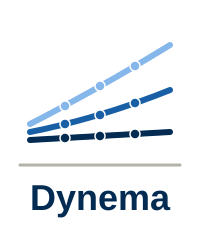

<p align="center">
  
</p>

# Dynema (Dynamic eQTL mapping for single cells)

[](https://github.com/joseah/Dynema.jl/actions/workflows/CI.yml?query=branch%3Amain)
[](https://joseah.github.io/Dynema.jl/dev/)
[](https://joseah.github.io/Dynema.jl/stable/)

*Dynema* is a method to map single-cell eQTL effects at real cellular resolution.

*Dynema*'s generalized framework enables testing complex regulatory effects including:

- **Main effects**: A standard eQTL effect, independent of any context
- **Interaction effects**: eQTL effects that dependent/vary depending on one (**single-context**) or more (**multi-context**) contexts
- **Total effects**: Joint effect of main and interaction eQTL components. This effect captures any genetic signal driven by either main or interaction eQTL effects


*Dynema* scales to genome-wide analysis, accounts for repeated measurements (multiple cells per donor), and provides calibrated p-values by using cluster-robust variance estimators (CRVEs). Additionally, it provides robust inferences in extreme scenarios including (1) small number of donors or (2) extreme imbalanced number cells per donor, by leveraging the score bootstrapping, implemented in [WildBootTests.jl](https://github.com/droodman/WildBootTests.jl).


# Installation

*Dynema* can be installed in Julia as follows:

```julia
using Pkg
Pkg.add(url = "https://github.com/joseah/Dynema.jl")
```

For more details and tutorials, see the [documentation website](https://joseah.github.io/Dynema.jl/dev/).

